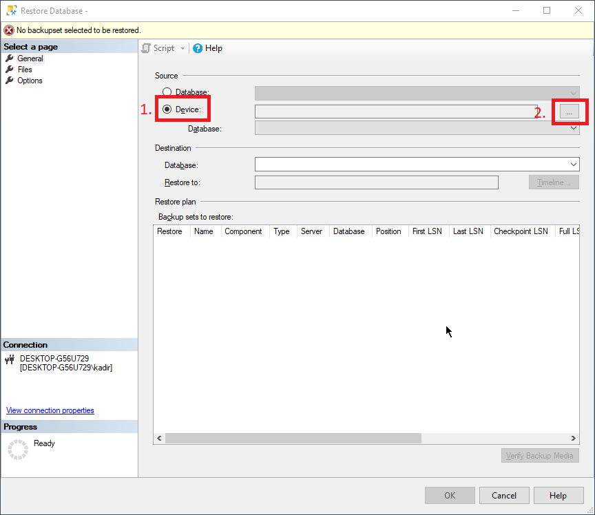
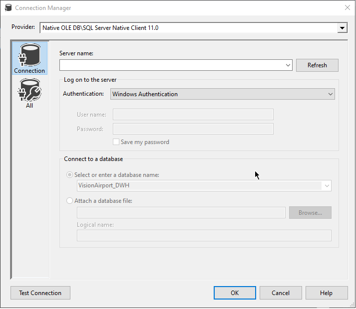

# VisionAirport: handleiding

Deze handleiding dient gevolgd te worden om het meegeleverd product correct op te stellen op een lokale machine of server. Gelieve hierbij eerst het zip bestand, waarin deze handleiding zich bevindt, uit te pakken.

## Database restore

Omdat het manueel importeren van de geleverde [bronbestanden](./Bronbestanden/) een aanzienlijk tijd in beslag kunnen nemen wordt er bij dit project een back-up bestand meegeleverd. Dit bestand kan gebruikt worden om de database op te zetten voor verder gebruik en kan [hier](./Backups/) teruggevonden worden.

De verschillende stappen worden hier uitgelegd:

1. Klik met rechtermuisknop op "Databases" in de Object explorer van MSSQL.

2. Druk vervolgens op "Restore Database..."

3. Nadat het volgende scherm verschijnt kies "Device" zoals aangeduid op de figuur en druk op het knop met "..." om het back-up bestand te zoeken in je lokaal systeem.

   

4. Klik nu op "OK" om de database te herstellen.

## Scripts uitvoeren

Om de DWH klaar te zetten moeten er een aantal queries uitgevoerd worden.

In de [Queries](./Queries) folder kan je alle queries terugvinden.

Het is wel belangrijk dat deze volgens een bepaalde volgorde worden uitgevoerd:

1.  [DecodeUTF8String.sql](Queries\DecodeUTF8String.sql): Functie om UTF8 tekst correct te decoden.
2.  [SetupDatabase.sql](Queries\SetupDatabase.sql): Database setup.
3.  [Cleaning.sql](Queries\Cleaning.sql): Data cleansing & Data insertion.
4.  [Script Dimensies & fact.sql](Queries\Script Dimensies & fact.sql): Script Dimensies & fact tabellen.

## SSIS-packages

Om de dimensies van de DWH in te laden met zuivere data werd SSIS gebruikt. De solution met alle SSIS-packages kunnen [hier](./SSIS) gevonden worden. 

Bij het uitvoeren van deze packages is het belangrijk dat eerst de nodige connecties naar de database gezet worden. 

De verschillende stappen bij dit process worden met volgende screenshots verduidelijkt:

1. Dubbelkik op de bestanden onder Connection Managers:

   

2. Nu zie je een scherm waar we de connectie kunnen beheren:

3. Selecteer "Native OLE DB\SQL Server Native Client 11.0" als provider en voer de correcte servernaam in van je machine.

4. Druk op OK en doe dit voor beide "DWH" en OLTP bestanden onder Connection Managers.

5. Voer alle SSIS packages één voor één uit volgens de volgende volgorde:

   1. dim_banen
   2. dim_datum
   3. dim_gate
   4. dim_luchthaven
   5. dim_maatschappij
   6. dim_tijd
   7. dim_vliegtuig_type
   8. dim_vliegtuig
   9. fact_vlucht

## PowerBI dashboard

Er is een rapport gemaakt met power BI om een mooi overzicht te geven van de gegevens in onze Datawarehouse. Let op! Tijdens het schoonmaken van de data zijn sommige gegevens niet opgenomen in de Datawarehouse omdat deze niet meer te recupereren waren. Die gegevens zijn opgeslagen in het archief maar ze worden niet meegerekend voor de rapportage. Het gaat om zeer weinig data dus dit zal geen grote impact hebben op de cijfers in de rapportage en de conclusies die men hieruit kan afleiden.

Om het rapport te openen moet power BI desktop geïnstalleerd zijn. Als je dubbelklikt op het bestand "Rapport.pbix" opent dit het rapport met oude data. De oude data is normaalgezien hetzelfde als de data die aangemaakt wordt na het uitvoeren van de scripts en SSIS packages. 

Als u het rapport wilt vernieuwen of het wilt openen met nieuwe data moeten volgende stappen worden uitgevoerd:

1. In Power BI druk op "Bestand"
2. Selecteer "Opties en instellingen"
3. Selecteer "Instellingen voor gegevensbron"
4. Selecteer de oude bron en druk op "Bron wijzigen". Verander de server naar uw lokale server en da database naar "VisionAirport_DWH"
   
5. Druk op Ok en sluit het venster. Druk vervolgens op "Vernieuwen"

Het rapport toont de volgende data:

1. Het aantal vluchten.
2. De gemiddelde vertraging (in minuten) voor alle vluchten.
3. Het percentage van de vluchten die geen vertraging hebben opgelopen. Voor dit percentage delen we de vluchten die minder dan 15 minuten vertraging hebben door het totaal aantal vluchten. De kleuren op de meter geven aan of dit percentage goed of slecht is (groen/rood)
4. Een wereldkaart met markeringen van luchthavens (de grote van de bubbel geeft aan hoeveel vluchten van deze luchthavens afkomstig zijn of vertrekken). Hier is ook een "drill through" functionaliteit voorzien die het aantal vluchten toont per stad
5. Een line chart van het aantal vluchten per maand. Hier is ook een "drill through" functionaliteit voorzien om het aantal vluchten per fiscale week te zien.
6. Een scatter chart van het aantal vluchten per gate gegroepeerd per terminal. De rode lijn is de mediaan van het aantal vluchten per gate. Op deze chart kunnen we makkelijk zien welke gates meer ingezet kunnen worden. De cargo vluchten worden niet aangeduid op deze chart omdat deze allemaal via terminal F gaan (terminal F heeft geen gates). Als we willen weten hoeveel vluchten door deze terminal gaan kijken we gewoon naar aantal vluchten.
7. Een horizontale bar chart die de top 10 luchthavens toont naar waar de meeste vluchten vertrekken of van waar de vluchten komen.

Er kan op volgende zaken gefilterd worden:

1. Jaar
2. Maatschappij
3. Soort vlucht
4. Op alle charts en de kaart kan men filteren door op data te drukken.